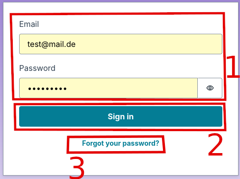
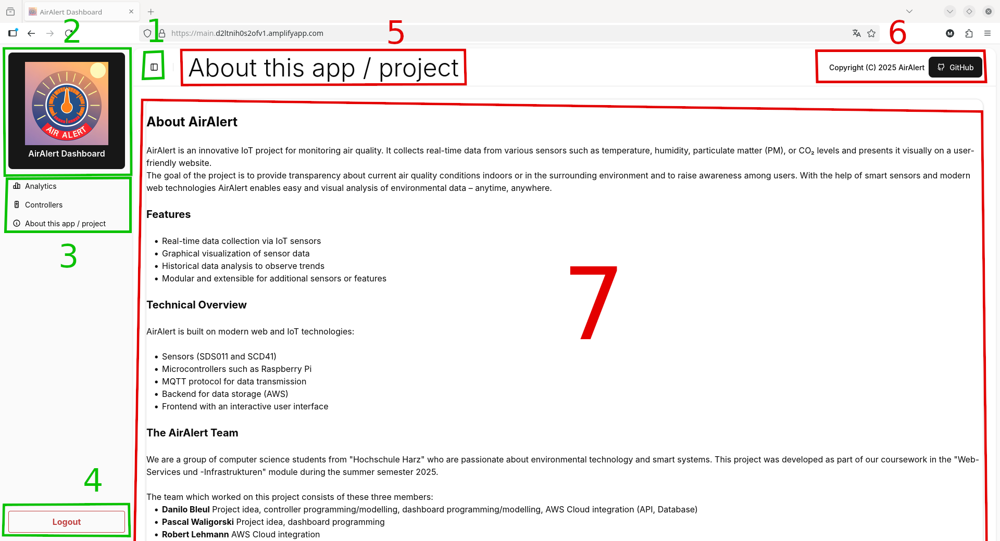
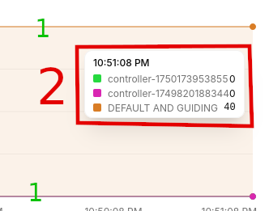
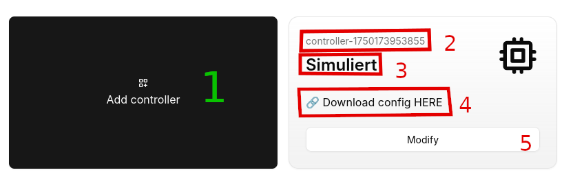
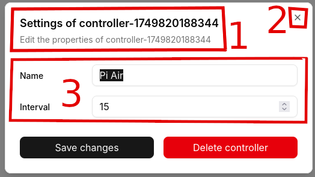
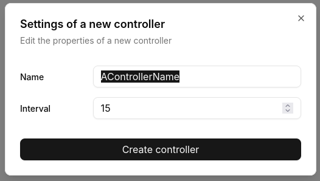

# AirAlert_IoT_web_panel
Code for the amplify deployment space to use as the web app for the project "AirAlert"

> !!!ATTENTION!!!
> For this repository, the [Amplify React+Vite template](https://github.com/aws-samples/amplify-vite-react-template) was used as a template.

## Description and Overview

This repository provides AWS Amplify configuration code for creating:
- an **API (REST)** for modifying controller properties and measurement data entries.
- a **Cognito** security implementation for restricted access
- a React-based frontend **web page** for visual data insight and configuration

## Installation and initialization

> !!!ATTENTION!!!
> Copying the repository's content and pasting it inside another is **not recommended**.
> Please **FORK** this repository if you want to deploy or develop inside its code.

### Preconfiguring the AWS cloud infrastructure

**MAKE SURE** you have yet followed the initial steps inside the [preparation repository](https://github.com/AirAlert-WR/server_repository). These are necessary for the web panel to work properly.

### Deploying to AWS

Short instruction:
Go to your admin console and navigate to the amplify section. Add a new GitHub connection for accessing the repository. Then, deploy the app (during this process, a build is also performed).

For detailed instructions on deploying this application, refer to the [deployment section](https://docs.amplify.aws/react/start/quickstart/#deploy-a-fullstack-app-to-aws) of Amazon's documentation.

### Adding a login user

For a successful login, at least **one user account** must be added to the recently deployed "Cognito" pool.

1. Navigate to **Amazon Cognito** using your console and open "User pools". Click on the identifier "**AirAlert User Pool**".
2. Open "User Management"->"Users" and create a **new user** with the following properties:
   - Don't send any invitation link
   - Email-Adress: **YOUR OWN**
   - Mark Email as **verified**
   - Set a password (instead of generating)
   - Password: **YOUR OWN**
3. Save the user.
4. Check your email account **before and after logging in**. Perhaps some additional confirmations should be done.

## Instruction to use

Once everything is loaded into and configured inside the cloud, you may open the web application **with the public link provided through Amplify**

In general, this app seems to be designed in a quite intuitive way, but, *for completeness*, here are general instruction how to operate.

As you're not logged in, you may see such a dialog at the first start:  

Where:
1. shows the input area for your login credentials
2. is the button for performing a login, while submitting the input
3. provides a password reset if clicked

After a successful login you're gonna look at this interface:  

Where:
1. is the button for expanding or showing the sidebar
2. is the panel (combined with application name and logo) that lets you navigate to the default page (while clicking on it)
3. collects entries of **all available sub pages** so you may navigate through the application (currently, the "About" screen is open)
4. is the "logout" button for closing the current user session
5. shows the programmed caption of the current sub page
6. leads you to the **GitHub** organisation bound with this project
7. is the sub page's container

### Inside the "Analytics" page

This sub page does not provide any buttons or clickable controls, but interactive diagrams for all stored data entry kinds of air quality measurement. 
While hovering over a diagram, you may experience a picture like this:  

Where:
1. shows the diagram value lines in a relative way (in this case, the upper line shows the guiding value)
2. is the popup info item showing the **exact values** for all registered controllers, together with the time

### Inside the "Controllers" page

This sub page implements a flow layout containing tiles. This picture shows the "Add button" (black) and a controller card:  

Where:
1. is the button for displaying a dialog to add a new controller
2. shows the unique identification of a given controller, generated and set by the cloud
3. displays the controller's caption (or purpose), defined inside the custom settings
4. provides a link to the **configuration archive** to download and unpack it inside the local controller application
5. opens the settings modification dialog

The open dialogs look like those:  
|||
|:-:|:-:|
Where:
1. displays an introductionary caption
2. should be clicked if you want to cancel the operation
3. is the area where the current settings (automatically displayed since initialization) may be modified.

For confirming the changes you may click the (mostly self-explaining) buttons at the bottom of each dialog.

### These are general-purpose explorer instructions. Feel free to adapt the application usage to your workflow...

## License

This library is licensed under the MIT-0 License. See the LICENSE file.
